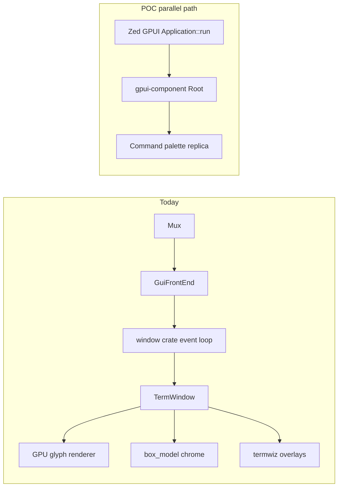

<!-- 7eae5932-71b3-42dc-a6fd-7d5d9c374e81 -->
---
todos:
  - id: "state-doc"
    content: "Create wezterm-gpui/docs/ (STATE.json, adr/, plans/, help/, decisions/) plus a Cursor rule pointing agents at that tree"
    status: completed
  - id: "dep-spike"
    content: "Add wezterm-gpui crate; pin Zed git GPUI + gpui-component via git SHA; cargo check -p wezterm-gpui green"
    status: completed
  - id: "hello-window"
    content: "Minimal Application::run + gpui_component::init + Root + Button window"
    status: completed
  - id: "palette-replica"
    content: "Recreate command palette with gpui-component in the new crate; leave wezterm-gui Modal path untouched"
    status: completed
  - id: "update-state"
    content: "Keep wezterm-gpui/docs/STATE.json current after each slice; append ADRs/decisions/findings in the same docs tree"
    status: completed
isProject: false
---
# GPUI feasibility spike for WezTerm

## Verdict

A **proof of concept is feasible** as a **separate binary/crate**. A **drop-in replacement of the existing UI inside `wezterm-gui` is not a baby step**.

GPUI is an application framework: it owns the native event loop (`GetMessage` / `NSApplication::run` / calloop) and creates its own windows. WezTerm already owns those same resources in [`window/`](window/) via [`GuiFrontEnd::run_forever`](wezterm-gui/src/frontend.rs) → `Connection::run_message_loop()`. Two blocking loops cannot coexist on one thread; AppKit cannot be nested; there is no public `from_hwnd` / foreign-window API.

So “replace small things one at a time” is true for **UI surfaces**, not for **windowing**. Until a later cutover, GPUI UIs live as sibling windows (or a sibling process), while the terminal keeps rendering in the current stack.

“Less code to maintain” only appears **after** a cutover of [`window/`](window/) plus box-model chrome. During the dual-stack period, **more** code is maintained. That is acceptable for this POC.



## What WezTerm actually has today

There are **three UI layers**, not one. GPUI does not replace all of them equally.

| Layer | Where | What it does | GPUI role |
|---|---|---|---|
| Native windowing | [`window/`](window/) (~50 files: Win32, Cocoa, X11, Wayland, EGL/WGL, menus, IME, DnD) | Event loop, HWND/NSWindow, clipboard, DPI | **Replaced only at full migration** by `gpui_platform` |
| Box model | [`wezterm-gui/src/termwindow/box_model.rs`](wezterm-gui/src/termwindow/box_model.rs) (~1.2k LOC) | CSS-like layout → quads | **Natural gpui-component target** |
| Box-model surfaces | fancy tab bar, window buttons, [`CommandPalette`](wezterm-gui/src/termwindow/palette.rs), [`CharSelector`](wezterm-gui/src/termwindow/charselect.rs), [`PaneSelector`](wezterm-gui/src/termwindow/paneselect.rs) via [`Modal`](wezterm-gui/src/termwindow/modal.rs) | Chrome + in-window modals | First incremental replacements |
| Termwiz overlays | [`wezterm-gui/src/overlay/`](wezterm-gui/src/overlay/) launcher, copy mode, debug, confirm, prompt, quickselect | Fake terminal panes via `start_overlay` | Later: Dialog / Input / Command palette |
| Terminal cells | [`render/pane.rs`](wezterm-gui/src/termwindow/render/pane.rs), glyph cache, `glium` + optional wgpu (`wgpu = "25.0.2"`) | Atlas, shaping, ligatures, images | **Stays forever** as a custom GPUI `Element` |

`use_box_model_render` in config is an experimental path to paint panes through the box model. It is not the main renderer. Do not treat it as the migration vehicle.

## Dependency strategy (Zed official GPUI)

Use **Zed’s official GPUI** from `zed-industries/zed` git, matching how [gpui-component](https://longbridge.github.io/gpui-component/docs/getting-started) is developed. Do **not** use gpui-ce or crates.io `gpui` 0.2.2 (stale vs git).

In the new crate, follow the documented install (then pin SHAs once a pair compiles):

```toml
[dependencies]
gpui = { git = "https://github.com/zed-industries/zed" }
gpui_platform = { git = "https://github.com/zed-industries/zed", features = ["font-kit"] }
gpui-component = { git = "https://github.com/longbridge/gpui-component" }
gpui-component-assets = { git = "https://github.com/longbridge/gpui-component" }
```

On Linux later, add `x11` / `wayland` features on `gpui_platform`. First spike is Windows.

Record the resolved SHAs in [`wezterm-gpui/docs/STATE.json`](wezterm-gpui/docs/STATE.json) (`pins`). Unpinned git HEAD will break the workspace whenever Zed or Longbridge moves.

Workspace notes:
- WezTerm docs say Rust 1.71; gpui-component wants **1.90+**. The repo already has `edition = "2024"` crates — confirm during the spike and store `toolchain.rustc` in STATE.json.
- Avoid workspace-wide `[patch]` unless a version conflict forces it. Prefer crate-level git deps + SHA pins.
- Multiple `wgpu` / `windows` crate versions can coexist. Sharing a GPU device between WezTerm OpenGL and GPUI D3D11/Metal/wgpu is **out of scope**.

## Docs tree (`wezterm-gpui/docs/`)

All migration writing lives **in-repo** under [`wezterm-gpui/docs/`](wezterm-gpui/docs/), next to the crate, not only in Cursor plan files or chat. Do **not** rely on chat history.

```
wezterm-gpui/
  src/                          # crate code
  docs/
    STATE.json                  # machine tracker (not for humans)
    help/                       # how to resume, how to check, constraints
    plans/                      # spike/migration plans (copy or canonical)
    adr/                        # numbered ADRs (append-only)
    decisions/                  # short decision records (or JSONL) if not an ADR yet
```

| Path | Role |
|---|---|
| [`docs/STATE.json`](wezterm-gpui/docs/STATE.json) | Live status: phase, next, blockers, pins, surfaces |
| [`docs/help/`](wezterm-gpui/docs/help/) | Agent/operator help: resume protocol, commands, architecture constraints |
| [`docs/plans/`](wezterm-gpui/docs/plans/) | Canonical plans (seed with this spike plan) |
| [`docs/adr/`](wezterm-gpui/docs/adr/) | Architecture Decision Records (`0001-use-zed-official-gpui.md`, …) |
| [`docs/decisions/`](wezterm-gpui/docs/decisions/) | Lightweight decisions before they graduate to an ADR |

[`.cursor/rules/gpui-migration.mdc`](.cursor/rules/gpui-migration.mdc) only **points** at this tree (read `docs/help/` + `docs/STATE.json` at session start; write back STATE + new adr/decision as needed). The rule is not the source of truth.

Seed on crate creation:
- Copy this spike plan into `docs/plans/000-feasibility-spike.md`
- ADR `0001`: use Zed official GPUI (not gpui-ce); use gpui-component; keep existing UI
- `docs/help/resume.md` (or `.json`): read order, commands, “do not share event loop”

Create the docs tree in the same change as the crate skeleton (even before code compiles). STATE.json schema (keep keys stable; append, do not rename):

```json
{
  "id": "wezterm-gpui-migration",
  "schema_version": 1,
  "updated": "ISO-8601",
  "status": "not_started|in_progress|blocked|paused|done",
  "current_phase": "state-doc|dep-spike|hello-window|palette-replica|ipc-launch|window-cutover|terminal-element|delete-old-ui",
  "next": [{ "id": "string", "action": "string", "blocked_by": [] }],
  "phases": [
    {
      "id": "dep-spike",
      "status": "pending|in_progress|done|skipped|blocked",
      "notes": ""
    }
  ],
  "decisions": [
    {
      "at": "ISO-8601",
      "decision": "use_zed_gpui_not_gpui_ce",
      "rationale": ""
    }
  ],
  "constraints": [
    "existing_ui_must_keep_working",
    "no_in_process_event_loop_sharing",
    "poc_shortcuts_ok"
  ],
  "pins": {
    "gpui_git": "https://github.com/zed-industries/zed",
    "gpui_rev": null,
    "gpui_component_git": "https://github.com/longbridge/gpui-component",
    "gpui_component_rev": null
  },
  "toolchain": { "rustc": null, "host": null },
  "commands": {
    "check": "cargo check -p wezterm-gpui",
    "run": "cargo run -p wezterm-gpui"
  },
  "surfaces": {
    "command_palette": {
      "status": "not_started",
      "legacy": "wezterm-gui/src/termwindow/palette.rs",
      "gpui": null
    }
  },
  "findings": [],
  "blockers": [],
  "go_nogo": { "in_process_embed": "no", "continue_poc": null }
}
```

Agent protocol (encode in `docs/help/` and the Cursor rule):
1. Read `wezterm-gpui/docs/help/` then `wezterm-gpui/docs/STATE.json` before planning or coding.
2. Treat `current_phase`, `next`, `blockers`, `pins` as authoritative for “where / what’s next”.
3. After any material change, update STATE.json; append ADRs under `docs/adr/` and short notes under `docs/decisions/` rather than only chatting.
4. Never delete `decisions` / `findings` in STATE.json or existing ADR files; only append.
5. New plans go in `docs/plans/`, not only in `.cursor/plans/`.

Answers STATE.json must support without rereading the plan: where we are (`current_phase` + `status`), what to do next (`next`), why (`docs/adr` + `docs/decisions` + STATE `decisions`), what is stuck (`blockers`), what compiled (`pins` + phase `done`), which UI surfaces moved (`surfaces`).

## Baby-step POC (does not touch existing UI)

Keep [`wezterm-gui`](wezterm-gui/) and [`window/`](window/) unchanged. Add a sibling crate.

### Step 0 — Docs tree + crate skeleton

Create [`wezterm-gpui/docs/`](wezterm-gpui/docs/) (STATE.json, help, plans, adr, decisions) and the Cursor pointer-rule first, then the crate so later agents have a home.

### Step 1 — Compile spike (~1–3 days)

Workspace member [`wezterm-gpui/`](wezterm-gpui/) (binary + lib). Edition 2021/2024. No dependency on `window` or `wezterm-gui`.

Goal: `cargo check -p wezterm-gpui` succeeds on Windows with Zed GPUI + gpui-component.

If the lockfile explosion or compile errors are severe, temporarily `exclude` the crate from the workspace and give it its own `Cargo.lock`. Re-join later. Log that in `docs/decisions/` and STATE.json.

### Step 2 — Hello window (~1 day)

Minimal `main` matching the [getting started](https://longbridge.github.io/gpui-component/docs/getting-started) sample: `gpui_platform::application().run`, `gpui_component::init(cx)`, `Root::new(...)`.

This proves event loop, D3D11 (Windows), theming, and assets. Run with `cargo run -p wezterm-gpui`.

### Step 3 — Recreate command palette as a GPUI window (~3–7 days)

Best first real surface: it already exists as a box-model [`Modal`](wezterm-gui/src/termwindow/palette.rs), and gpui-component ships a Command palette.

POC shortcuts (allowed):
- Standalone window, not an overlay inside the terminal
- Hardcoded / sample command list, or a thin read of `config` + `commands` if that is easy
- No IME/focus handoff back to a WezTerm pane
- Feature-flag or just a separate binary; **do not** wire `ActivateCommandPalette` yet unless Step 4 is cheap

Existing palette stays the default. Update `surfaces.command_palette` in `docs/STATE.json`.

### Step 4 (optional, still POC) — Launch from WezTerm without sharing a loop

Spawn `wezterm-gpui` as a **child process** from a debug key / CLI (`wezterm gpui-palette`). IPC can be stdout JSON or a one-shot mux call. Ugly UX, honest architecture: two processes, two loops, no GPU sharing.

Skip in-process GPUI windows inside `wezterm-gui`. That requires a custom `Platform` (see below).

## What a real migration means (blast radius)

Ordered by coupling. Later layers assume earlier ones. Track each as a `phases[]` entry in `docs/STATE.json` when work starts.

### A. Chrome-only (after GPUI owns some windows) — medium

Replace box-model surfaces with gpui-component, still not the terminal:

- Command palette, char select, pane select
- Confirm/prompt (today termwiz overlays)
- Fancy tab bar / window buttons (only if the tab bar lives in a GPUI window or a GPUI titlebar)
- Future: settings UI, menus (`NativeMenu`), dock/splits

**Blast radius:** [`palette.rs`](wezterm-gui/src/termwindow/palette.rs), [`charselect.rs`](wezterm-gui/src/termwindow/charselect.rs), [`paneselect.rs`](wezterm-gui/src/termwindow/paneselect.rs), [`overlay/*`](wezterm-gui/src/overlay/), [`fancy_tab_bar.rs`](wezterm-gui/src/termwindow/render/fancy_tab_bar.rs), [`window_buttons.rs`](wezterm-gui/src/termwindow/render/window_buttons.rs), [`modal.rs`](wezterm-gui/src/termwindow/modal.rs), [`box_model.rs`](wezterm-gui/src/termwindow/box_model.rs). Lua GUI events that assume in-window overlays need a compatibility story.

**Does not reduce** [`window/`](window/) or glyph rendering.

### B. Windowing cutover — large (the real cost)

Replace [`window/`](window/) with `gpui_platform`. This is where “less code” is real (~OS backends, EGL, WGL, X11, Wayland).

Must re-prove: IME, dead keys, clipboard/primary selection, DnD, DPI, fullscreen, always-on-top, window class, macOS menu bar, Wayland CSD, visual bell, screens/geometry, lua `window` APIs.

WezTerm-specific window features that GPUI may not match 1:1 (need a gap analysis during/after the spike): window level, tabbing, increment resize to cell size, `raw-window-handle` for wgpu surface, etc.

**Cannot be incremental per window in one process** without a custom GPUI `Platform` that pumps WezTerm’s loop and parents child views. That is a new backend, not a config flag.

### C. Terminal as a GPUI `Element` — large, and not gpui-component

gpui-component does not draw terminal cells. The glyph atlas, harfbuzz shaping, ligatures, underlines, images, and sixel/iterm graphics stay WezTerm code, wrapped as a custom `Element` that paints into GPUI’s scene (or a native surface).

This is the hard GPU problem: WezTerm is OpenGL (`glium`) + optional wgpu 25; GPUI on Windows is D3D11 (optional wgpu), macOS Metal, Linux wgpu. A custom `Element` using GPUI primitives is the intended path; sharing WezTerm’s existing GL context inside a GPUI window is not.

### D. Dual-stack endgame

At some point chrome + terminal + windowing must be one framework. Keep the old path behind a binary (`wezterm-gui` vs `wezterm-gpui`) or a compile feature until GPUI can start a session, draw glyphs, and accept keys. Then delete `box_model`, OS backends, and termwiz overlay UIs.

## Effort sketch (order of magnitude)

| Slice | Effort | Outcome |
|---|---|---|
| Tracker + docs tree + crate skeleton | hours | Agents can resume from `wezterm-gpui/docs/` |
| Compile Zed GPUI + gpui-component in-tree | days | Go/no-go on deps/lockfile |
| Hello window | ~1 day | Proves loop + theme |
| Command palette replica | ~1 week | Proves components vs box-model |
| Child-process launch from WezTerm | days | Proves “replace one surface” without sharing a loop |
| Custom Platform to embed GPUI in WezTerm windows | many weeks | Only if in-window overlays are mandatory before cutover |
| Replace `window/` + terminal `Element` | multiple quarters | Real migration |
| Delete old UI | after parity | Actual code-size win |

## Risks to treat as spike findings (append to `docs/STATE.json` `findings`; promote to ADR if they stick)

- Unpinned Zed git vs gpui-component git drifting
- Workspace lockfile / `windows` / `wgpu` / `smol` duplication
- Rustc 1.90 vs documented 1.71
- Binary size and compile time of gpui in a WezTerm checkout
- Focus, IME, and keybindings if a GPUI palette is a separate window
- Accessibility / screen readers (GPUI vs current path)
- License is fine (Apache-2.0 vs WezTerm MIT)

## Success criteria for this POC

1. `wezterm-gpui/docs/` exists with STATE.json, help/, plans/, adr/, decisions/.
2. `cargo check -p wezterm-gpui` works with **Zed git GPUI** + gpui-component.
3. A window opens with gpui-component widgets (theme + button at minimum).
4. A command-palette-shaped UI exists in that crate; existing palette still works in `wezterm-gui`.
5. `docs/STATE.json` has pins, findings, and `go_nogo.continue_poc`.

No changes to default WezTerm behavior. No `cargo build --release`. Validate with `cargo check -p wezterm-gpui` (and `cargo run -p wezterm-gpui` only when the window itself needs to be seen).
